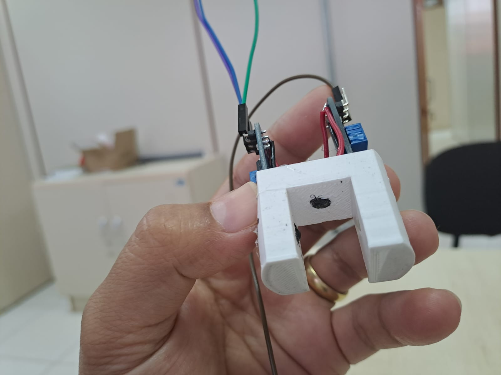
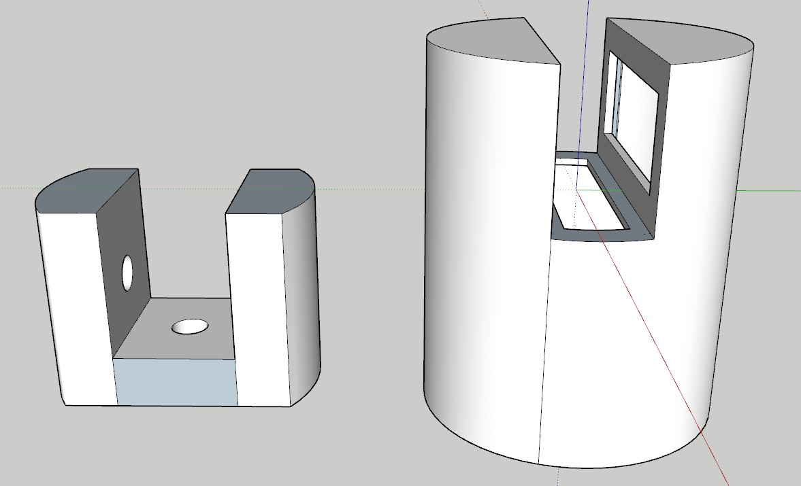

# Turbisense
Este é um projeto open-hardware e open-source de um turbidímetro para medição da turbidez em líquidos, ou seja, a concentração de partículas sólidas suspensas na amostra. 

Este é um projeto de sensor de turbidez desenvolvido como trabalho de conclusão de curso. O objetivo do projeto é criar um sensor de baixo custo e fácil de usar para medir a turbidez em líquidos.

O sensor de turbidez Turbisense funciona através do princípio de transmitância, utilizando um transmissor de luz infravermelha com comprimento de onda de 850 nm e um par de fotodiodos para medir a quantidade de luz que é transmitida através de um líquido ou suspensão.

O fotodiodo a 90 graus é utilizado para medir a quantidade de luz difusa, que é refletida pelas partículas em suspensão, enquanto que o fotodiodo a 180 graus mede a quantidade de luz transmitida diretamente pelo líquido. A diferença entre a quantidade de luz medida pelos dois fotodiodos é usada para determinar a turbidez da amostra.

O sensor é alimentado por uma fonte de alimentação de 5V e é conectado ao microcontrolador através de duas portas analógicas. A porta A0 é usada para medir a quantidade de luz difusa, enquanto que a porta A1 é usada para medir a quantidade de luz transmitida diretamente.

O sensor é baseado em um microcontrolador e utiliza um método óptico para medir a turbidez. Ele é capaz de medir a concentração de partículas sólidas suspensas em líquidos com alta precisão e rapidez.

O repositório contém todos os arquivos necessários para reproduzir o projeto, incluindo o firmware do microcontrolador, software de auxílio, modelos em 3D e arquivos de CNC para a fabricação da carcaça do sensor, além da placa de circuito impresso (PCI).

 
